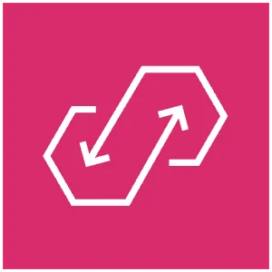

# &nbsp;&nbsp; Amazon AppFlow

## 概要

**SaaSアプリケーションとAWSサービス間でデータを自動転送**するフルマネージドな統合サービス。
コードを書かずにSalesforceやSlackなどのデータをS3やRedshiftに取り込める。

```
SaaSアプリ（データ送信元）
├── Salesforce
├── Slack
├── ServiceNow
├── Zendesk
├── Google Analytics（GA4 / Google Analytics 4 対応）
└── SAP など
        ↓ Amazon AppFlow（ノーコードで連携）
AWS サービス（データ送信先）
├── Amazon S3
├── Amazon Redshift
├── Amazon EventBridge
├── Amazon RDS for PostgreSQL
├── Amazon SageMaker（Data Wrangler）
├── Snowflake
└── Salesforce（双方向も可）
```

---

## 設定方法

コードなしでGUI（マネジメントコンソール）から設定できる。

```
① フロー（Flow）を作成
    ↓
② 送信元を選択（Salesforce・Slack・Zendesk など）
    ↓
③ 認証情報を入力（OAuth・APIキーなど）
    ↓
④ 送信先を選択（S3・Redshift など）
    ↓
⑤ フィールドマッピングを設定
   例: Salesforceの「Account_Name」→ S3の「account_name」
    ↓
⑥ フィルタ・マスキングを設定
   例: 「金額が0円のレコードは除外」
    ↓
⑦ トリガーを設定（スケジュール・イベント・オンデマンド）
    ↓
⑧ フローを有効化 → 自動で動き続ける
```

IaC（インフラをコードで管理）したい場合は **CloudFormation / Terraform** でも定義できる。

```
ノーコードで設定したい → マネジメントコンソール（GUI）
IaCで管理したい       → CloudFormation / Terraform
```

---

## 特徴

### ノーコード・低コードで設定できる

カスタムコードや複雑なETLパイプラインを書かずに、**マネジメントコンソールで設定するだけ**でSaaSのデータをAWSに取り込める。

```
従来の方法:
SaaS API → カスタムコードで取得 → 変換スクリプト → S3に保存
（開発・運用コストがかかる）

AppFlow:
コンソールで接続先・スケジュール・変換を設定するだけ ✅
```

### データ変換機能（組み込み）

転送中にデータを変換できる。

| 変換機能 | 説明 |
|---------|------|
| **フィルタリング** | 条件に合うレコードだけ転送 |
| **マッピング** | フィールド名を変換（Salesforceの項目名 → S3のカラム名） |
| **マスキング** | 個人情報などを隠す（クレジットカード番号など） |
| **結合・分割** | フィールドの結合や分割 |

---

## 実行トリガーの種類

| トリガー | 説明 | 例 |
|---------|------|-----|
| **スケジュール** | 定期実行 | 毎日0時にSalesforceのデータを取得 |
| **オンデマンド** | 手動実行 | 必要なときだけ実行 |
| **イベント** | SaaS側の変更を検知して実行 | Salesforceでレコードが更新されたら転送 |

---

## DataSync・DMS との違い

| 観点 | AppFlow | DataSync | DMS |
|------|---------|----------|-----|
| 対象 | **SaaSアプリ** | ファイル・オブジェクト | データベース |
| 用途 | SaaS → AWS のデータ取り込み | ファイル転送・同期 | DB移行・レプリケーション |
| コード | 不要（ノーコード） | 不要 | 不要 |

```
Salesforce・Slack・ServiceNow のデータをAWSに取り込みたい → AppFlow
ファイルサーバーを S3 に移したい                         → DataSync
データベースを移行したい                                  → DMS
```

---

## Glue との違い

どちらもデータ統合に使えるが用途が違う。

| 観点 | AppFlow | AWS Glue |
|------|---------|----------|
| データソース | SaaSアプリ | S3・RDS・DynamoDB など |
| 設定方法 | ノーコード | コード（Python/Scala）が必要 |
| 向いているケース | SaaSからの定期取り込み | 複雑なETL・大規模変換 |

---

## ユースケース

| ユースケース | 説明 |
|------------|------|
| **CRMデータ分析** | SalesforceのデータをRedshiftに取り込んで分析 |
| **サポートデータ分析** | ZendeskのチケットデータをS3に蓄積 |
| **マーケティング分析** | Google AnalyticsのデータをS3に取り込む |
| **社内データ統合** | 複数SaaSのデータをS3のデータレイクに集約 |

---

## Slackデータの活用例

Slackから取得できるデータ：
- チャンネルのメッセージ
- ユーザー情報
- チャンネル情報
- ファイル共有の記録

### ① コンプライアンス・アーカイブ（最も多いユースケース）

```
Slack メッセージ → AppFlow → S3
「誰がいつ何を発言したか」を保存
→ 金融・法務業界で社内通信の記録保存が義務
```

### ② チームの感情分析

```
Slack メッセージ → AppFlow → S3
    ↓
Amazon Comprehend（自然言語処理）で分析
    ↓
チームのモチベーション・疲弊度を可視化
```

### ③ カスタマーサポート分析

```
Slack Connect（顧客とのやりとり）→ AppFlow → Redshift
    ↓
対応時間・よく来る問い合わせを分析
    ↓
サポート品質の改善に活用
```

### ④ セキュリティ監視

```
Slack メッセージ → AppFlow → S3 → Amazon Macie
    ↓
クレジットカード番号・パスワードなどの
機密情報が共有されていないか検知
```

---

## 実務との対応

実務でAurora → Glue → S3 のパイプラインを作っていたが、
SaaSが絡む場合はAppFlowが有効。

```
【SaaSデータを含む分析基盤の例】
Salesforce → AppFlow → S3（データレイク）
Aurora     → Glue   → S3（データレイク）
                ↓
          Amazon Athena / Redshift（統合分析）
```

---

## 試験のポイント

- **SaaSアプリからのデータ取り込み** → AppFlow
- **ノーコードでSaaS連携** → AppFlowの強み
- **Salesforce・Slack・ServiceNow** → AppFlowの代表的な連携先
- **データ変換（フィルタ・マスキング・マッピング）** が組み込みで使える
- **DMS・DataSyncとの違い** → AppFlowはSaaS専用
