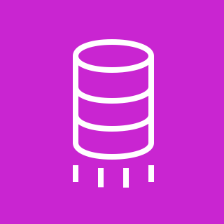

# &nbsp;&nbsp; AWS DMS（Database Migration Service）

## 概要

データベースをAWSに**移行・レプリケーション**するサービス。
移行中もソースDBを稼働させたまま移行できるため、**ダウンタイムを最小化**できる。

```
ソースDB（移行元）
├── Oracle / SQL Server / MySQL / PostgreSQL
├── MongoDB / Aurora / DynamoDB
└── オンプレ / 他クラウド
        ↓ AWS DMS
ターゲットDB（移行先）
├── Amazon Aurora / RDS
├── Amazon Redshift
├── Amazon DynamoDB
└── Amazon S3
```

---

## 2種類の移行パターン

### ① 同種移行（Homogeneous Migration）
同じDBエンジン間の移行。スキーマ変換が不要。

```
MySQL → Amazon RDS for MySQL
Oracle → Amazon RDS for Oracle
PostgreSQL → Amazon Aurora PostgreSQL
```

### ② 異種移行（Heterogeneous Migration）
異なるDBエンジン間の移行。**SCT（Schema Conversion Tool）** を使ってスキーマを変換してからDMSで移行。

```
Oracle → Amazon Aurora PostgreSQL
SQL Server → Amazon Aurora MySQL
        ↑
SCT でスキーマを変換してから DMS で移行
```

---

## DMS の構成要素

```
ソースエンドポイント（移行元DBの接続情報）
        ↓
レプリケーションインスタンス（移行処理を実行するEC2）
        ↓
ターゲットエンドポイント（移行先DBの接続情報）
```

| 構成要素 | 説明 |
|---------|------|
| **ソースエンドポイント** | 移行元DBの接続情報（ホスト・ポート・認証情報） |
| **レプリケーションインスタンス** | 実際に移行処理を行うEC2インスタンス |
| **ターゲットエンドポイント** | 移行先DBの接続情報 |

---

## ダウンタイムを最小化できる

DMSの最大の強みは**稼働中のDBをそのまま移行できる**こと。

```
【従来の移行（ダウンタイムあり）】
① 本番DBを停止
② データをエクスポート
③ 新DBにインポート
④ 新DBに切り替え
← この間ずっとサービス停止！

【DMS フルロード + CDC（ダウンタイムほぼゼロ）】
① 本番DB稼働したままフルロードで既存データを移行
② CDCで移行中の差分をリアルタイム同期し続ける
③ 差分がほぼゼロになった瞬間だけ切り替え
← サービスを止めるのは切り替えの一瞬だけ！
```

ECサイト・金融系など**24時間365日止められないシステム**での移行で特に威力を発揮する。

---

## 移行方式

### フルロード（Full Load）
既存の全データを一括で移行する。

```
ソースDB（全データ）→ DMS → ターゲットDB
```

### CDC（Change Data Capture）
移行中・移行後の**差分データをリアルタイムで同期**する。
フルロードと組み合わせることでダウンタイムを最小化できる。

```
① フルロードで既存データを移行
② CDC で移行中に発生した差分を継続的に同期
③ 差分がなくなったタイミングでカットオーバー（切り替え）
```

```
ソースDB（稼働中）
    ↓ ① フルロード
    ↓ ② CDC（差分をリアルタイム同期）
ターゲットDB
    ↓ ③ 差分ゼロになったら切り替え
本番切り替え完了（ダウンタイムほぼゼロ）
```

---

## SCT（Schema Conversion Tool）

異種移行のときにスキーマ・SQLを自動変換するツール。

```
Oracle の PL/SQL → PostgreSQL の構文に自動変換
SQL Server のストアドプロシージャ → Aurora MySQL に変換
```

変換できない部分は手動対応が必要なため、100%自動化はできないケースもある。

---

## 移行元はオンプレ専用ではない

DMSはオンプレ専用ではなく、**AWSサービス間・他クラウドからの移行にも対応**。

```
【移行元として使えるもの】
オンプレのDB    → MySQL・Oracle・SQL Server など
AWSのDB        → RDS・Aurora・DynamoDB
他クラウドのDB  → GCP Cloud SQL・Azure SQL など
```

```
【よくある移行パターン】
オンプレ Oracle  → Amazon Aurora     （クラウド移行）
Amazon RDS MySQL → Amazon Aurora      （AWS内の移行）
Aurora MySQL     → Amazon Redshift    （分析基盤への移行）
他クラウドのDB   → Amazon RDS         （他クラウド → AWS）
```

### AWS内でのAurora MySQL → Aurora PostgreSQL 移行

同じAurora同士でもエンジンが違えば**異種移行**になるためSCTが必要。

```
① SCT でスキーマ変換
  Aurora MySQL のテーブル定義・ストアドプロシージャ
      ↓ 自動変換
  Aurora PostgreSQL 用のSQL に変換

② DMS でデータ移行
  Aurora MySQL（稼働中）
      ↓ フルロード + CDC
  Aurora PostgreSQL
```

```
【同種移行（SCT不要）】
Aurora MySQL      → RDS MySQL          ← 同じMySQL
Aurora PostgreSQL → RDS PostgreSQL     ← 同じPostgreSQL

【異種移行（SCT必要）】
Aurora MySQL      → Aurora PostgreSQL  ← エンジンが違う！
Oracle            → Aurora PostgreSQL  ← エンジンが違う！
```

---

## DataSync との違い

| 観点 | AWS DMS | AWS DataSync |
|------|---------|-------------|
| 対象 | **データベース** | ファイル・オブジェクト |
| 用途 | DBの移行・レプリケーション | ファイルシステムの転送・同期 |
| CDC対応 | あり（差分同期） | なし |

```
DBを移行したい           → AWS DMS
ファイルサーバーをS3に移したい → AWS DataSync
```

---

## 実務との対応

実務でやっていたAurora MySQLは、DMSを使えばAurora PostgreSQLやRedshiftに移行できる。

```
【実務の構成】
Aurora MySQL → Glue → CSV → S3 → BigQuery

【DMS を使った移行例】
Aurora MySQL → DMS → Amazon Redshift（分析基盤をAWSで完結）
```

---

## 試験のポイント

- **DB移行・レプリケーション** → AWS DMS（ファイルはDataSync）
- **ダウンタイム最小化** → フルロード + CDC の組み合わせ
- **異種DB移行** → SCT でスキーマ変換してから DMS
- **CDC** = Change Data Capture（差分をリアルタイム同期）
- **レプリケーションインスタンス** = 移行処理を行うEC2（サイズ選択が必要）
- **継続的なレプリケーション** にも使える（移行後も差分同期し続ける）
