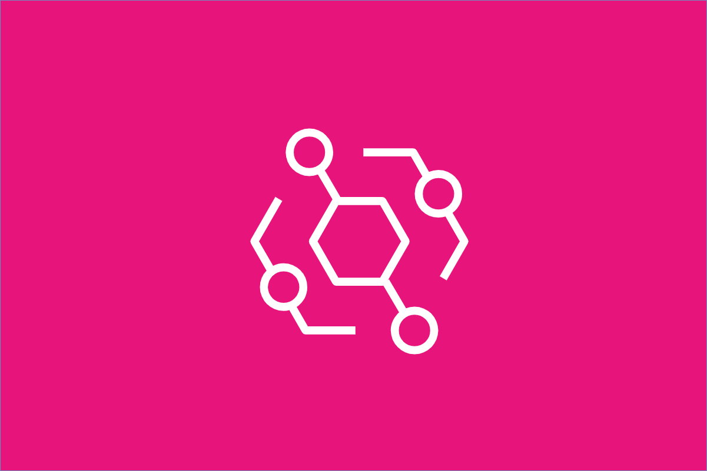

# &nbsp;&nbsp; Amazon EventBridge

## 概要

AWSサービスやアプリケーション間を**イベントで繋ぐサーバーレスのイベントバス**。
「何かが起きたら → 何かを実行する」という仕組みを簡単に構築できる。

---

## 2つのトリガー方式

### ① スケジュールベース（Schedule）

**「決まった時間に実行する」** → cronやrateで指定。

```
rate(1 day)        → 毎日実行
cron(0 9 * * ? *)  → 毎日9時に実行
```

実務でよく使うパターン：

```
EventBridge（毎日0時）
    ↓
Step Functions → Lambda / Glue / AWS Batch
```

### ② イベントベース（Event）

**「何かが起きたら実行する」** → AWSサービスのイベントを検知して起動。

```
S3にファイルがアップロードされた   → Lambda を起動
EC2インスタンスが停止した         → SNS で通知
Glueジョブが失敗した             → Lambda でSlack通知
CodePipelineがデプロイ完了した    → Step Functions を起動
```

---

## スケジュールベース vs イベントベース

| 観点 | スケジュールベース | イベントベース |
|------|-----------------|-------------|
| トリガー | 時間 | AWSサービスの出来事 |
| 実行タイミング | 予測可能 | 予測不可能（いつ起きるかわからない） |
| 用途 | 定期バッチ・日次集計 | 自動化・リアクティブ処理 |
| 実務例 | 毎日0時にGlueジョブを実行 | S3にファイルが来たらLambdaで処理 |

---

## アーキテクチャ

```
イベントソース（何が起きたか）
├── AWSサービス（S3・EC2・Glue・DynamoDB など）
├── カスタムアプリケーション
└── SaaSパートナー（Datadog・Zendesk など）
        ↓
EventBridgeイベントバス（イベントを受け取る）
        ↓
ルール（どのイベントに反応するか）
        ↓
ターゲット（何を実行するか）
├── AWS Lambda
├── AWS Step Functions
├── Amazon SQS
├── Amazon SNS
├── Amazon Kinesis Data Streams
├── AWS Batch
└── AWS Glue
```

---

## イベントバスの種類

| 種類 | 説明 |
|------|------|
| **デフォルトバス** | AWSサービスのイベントを受け取る（自動で存在する） |
| **カスタムバス** | 自分のアプリケーションのイベントを送受信する |
| **パートナーバス** | SaaSサービス（Datadog・Salesforce など）からのイベント |

---

## 実務との対応

今まで実装したバッチ処理の起動はほぼEventBridgeが起点になっている。

```
【実務でやってきた構成】
EventBridge（スケジュール）→ Step Functions → Lambda / Glue

【AWSデータパイプラインでの典型構成】
EventBridge（スケジュール）→ Step Functions → AWS Batch（大規模バッチ）
EventBridge（S3イベント）  → Lambda（ファイル到着時に即処理）
EventBridge（Glue失敗）   → Lambda → Slack通知
```

---

## EventBridge Pipes

イベントソースからターゲットへの**ポイントツーポイント連携**をシンプルに構築できる機能。
フィルタリング・変換・エンリッチメントを間に挟める。

```
ソース（Kinesis・SQS・DynamoDB Streams など）
    ↓ フィルタリング（条件に合うイベントだけ通す）
    ↓ エンリッチメント（Lambdaでデータを追加）
    ↓
ターゲット（Lambda・Step Functions・Batch など）
```

---

## EventBridge Scheduler

**2022年11月GAの専用スケジューリング機能**。タスクの定期実行・1回限り実行に特化する。

従来の scheduled rule（cron / rate ルール）に比べ、以下の利点がある。

| 観点 | scheduled rule（旧） | EventBridge Scheduler |
|------|---------------------|----------------------|
| タイムゾーン | 非対応（UTC基準） | 対応（タイムゾーン・DST考慮） |
| 1回限りスケジュール | できない | できる（one-time） |
| スケール | ルール数に上限 | 数百万タスクへスケール |
| 再試行 | 限定的 | 柔軟な再試行・DLQ設定が可能 |

```
スケジュールタスク（定期実行・1回限り実行）
→ 現在は EventBridge Scheduler の利用が推奨
→ 旧 scheduled rule（cron/rate ルール）はレガシー扱い
```

- イベント駆動の連携（イベントバス・ルール・Pipes）は引き続き従来どおり使う。Schedulerはあくまで「時刻起点の実行」に特化した機能。

---

## Kinesis・SQSとの違い

どれも「イベント・メッセージを扱う」サービスだが用途が違う。

| 観点 | EventBridge | Kinesis | SQS |
|------|------------|---------|-----|
| 用途 | AWSサービス間のイベントルーティング | 大量ストリームデータの処理 | キューによるメッセージ配信 |
| データ量 | 少量（イベント通知） | 大量（継続的なデータ） | 中量（タスクキュー） |
| 向いている用途 | サービス連携・自動化 | リアルタイム分析 | 非同期処理・デカップリング |

---

## 試験のポイント

- **定期実行（cron・rate）** → EventBridgeスケジュール。**定期実行・1回限り実行は EventBridge Scheduler が推奨**（タイムゾーン対応・大規模スケール・柔軟な再試行。旧 scheduled rule はレガシー扱い）
- **AWSサービスの変化に反応** → EventBridgeイベントルール
- **S3ファイル到着 → Lambda起動** → EventBridgeのS3イベント（またはS3トリガー）
- **Glue/Batchの失敗通知** → EventBridge → SNS/Lambda
- **イベントベースとスケジュールベースの違い** → 試験頻出
