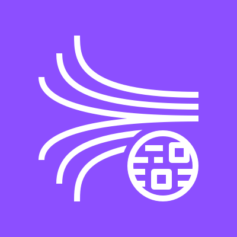
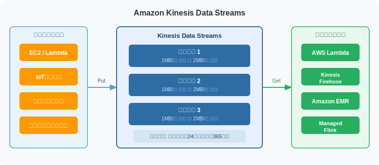

# &nbsp;&nbsp; Amazon Kinesis Data Streams

## アーキテクチャ図



## 概要

リアルタイムのデータストリームを**収集・保持**するサービス。
IoTセンサー・クリックストリーム・ログなど大量のデータをリアルタイムで処理するために使う。

→ ストリーミング処理の概念は [ストリーミング処理とバッチ処理](../00_concepts/ストリーミング処理とバッチ処理.md) を参照。

---

## アーキテクチャ

```
プロデューサー（データ送信側）
├── EC2 / Lambda
├── IoTデバイス
├── モバイルアプリ
└── クリックストリーム
        ↓ データを送信（Put）
┌─────────────────────────────┐
│   Kinesis Data Streams      │
│  ┌────┐ ┌────┐ ┌────┐      │
│  │シャード│ │シャード│ │シャード│      │
│  └────┘ └────┘ └────┘      │
└─────────────────────────────┘
        ↓ データを取得（Get）
コンシューマー（データ受信側）
├── AWS Lambda
├── Kinesis Data Firehose
├── Amazon EMR
└── Amazon Managed Service for Apache Flink
```

---

## データの流れ方

Kinesisは**一時的な通過点**であり、永続保存はしない。
データは時系列順（発生した順番通り）に保持され、コンシューマーが順番に処理する。

```
S3・DynamoDB  → 倉庫（永続保存）
Kinesis       → ベルトコンベア（一時保持・流す）
```

典型的な構成：

```
データ発生
    ↓
Kinesis（一時保持・時系列順に流す）
    ↓
Lambda（処理）
    ↓
S3 / DynamoDB（永続保存）← ここで初めて「残る」
```

### 順番保証とパーティションキー

時系列順の保証は**同じシャード内のみ**。

```
シャード1: [A] → [C] → [E]  ← この中では順番保証
シャード2: [B] → [D]        ← この中では順番保証

シャード1とシャード2をまたいだ順番は保証されない！
```

**パーティションキー**を使うと、同じキーのデータを必ず同じシャードに振り分けられる。

```
例: ユーザーIDをパーティションキーに設定
→ 同じユーザーのデータは必ず同じシャードに入る
→ そのユーザーの操作順序が保証される
```

### Lambdaとのイベントソースマッピング

**イベントソースマッピング**を設定すると、Kinesisにデータが来たとき自動でLambdaが起動する。
スケジューラー（EventBridge）が不要で、**データが来た瞬間に起動**できるのがポイント。

```
【バッチ処理の起動方法（経験あり）】
EventBridgeスケジュール →「毎日0時に起動！」→ Lambda/Glue

【Kinesisの起動方法】
イベントソースマッピング →「データが来たら即起動！」→ Lambda
```

仕組み：

```
Kinesisにデータ到着
    ↑
LambdaがKinesisをずっとポーリング（裏でAWSが管理）
    ↓ 新しいレコードを検知！
Lambdaが自動起動
    ↓ バッチでまとめて受け取る
[レコード1, レコード2, レコード3 ...]
    ↓
Lambdaが処理
```

→ 詳細は [イベントソースマッピング](../00_concepts/イベントソースマッピング.md) を参照。

---

## シャード（Shard）

Kinesis Data Streamsの**処理単位**。スループットはシャード数で決まる。

| 方向 | 上限 |
|------|------|
| 書き込み（入力） | 1シャードあたり 1MB/秒 または 1,000レコード/秒 |
| 読み取り（出力） | 1シャードあたり 2MB/秒 |

- データ量が増えたら**シャードを追加**してスケールアップ
- シャード数が足りないと `ProvisionedThroughputExceededException` エラーが発生

---

## データの保持期間

| 設定 | 保持期間 |
|------|---------|
| デフォルト | **24時間** |
| 延長可能 | 最大 **365日** |

保持期間中はデータを何度でも再読み取りできる。

---

## 処理タイミングのパターン

Kinesisは「すぐに処理する」だけでなく、ユースケースによって処理タイミングが異なる。

```
【パターン1: 即時処理】ミリ秒〜秒単位
データ到着 → Lambda即起動 → リアルタイム不正検知・アラート

【パターン2: 少し溜めて処理】数秒〜数分単位
データ到着 → ある程度バッファリング → Lambdaでまとめて処理

【パターン3: 配信目的】数分単位
データ到着 → Firehose経由 → S3に定期的に蓄積
```

### Kinesisを選ぶ判断軸

**「リアルタイム性が必要かどうか」** がKinesis vs バッチ（Glue）の分かれ目。

| ユースケース | 向いている処理 |
|------------|-------------|
| 売上の日次集計レポート | Glue（バッチ）で十分 |
| クレジットカード不正検知 | Kinesis（リアルタイム）が必須 |
| IoTセンサーの異常アラート | Kinesis（リアルタイム）が必須 |
| 大量ログの定期分析 | Glue（バッチ）で十分 |

```
バッチ（Glue）:    1時間分溜めてから処理 → 最大1時間遅延
Kinesis+Lambda:  到着した瞬間に処理   → 数秒以内
```

---

## Kinesis Data Streams vs Kinesis Data Firehose

よく混同されるので違いをしっかり覚えること。

| 観点 | Kinesis Data Streams | Kinesis Data Firehose |
|------|---------------------|----------------------|
| 目的 | リアルタイム処理・柔軟な加工 | S3/Redshift等への配信 |
| コンシューマー | 自分で実装が必要 | AWS管理（設定するだけ） |
| 遅延 | ミリ秒単位 | 数十秒〜数分（バッファリングあり） |
| データ保持 | 最大365日 | 保持しない（配信したら消える） |
| スケーリング | シャードを手動管理 | 自動スケーリング |
| 管理コスト | 高い | 低い |
| 向いている用途 | 複雑なリアルタイム処理 | シンプルなデータ配信 |

```
【Kinesis Data Streams を使うケース】
リアルタイムで不正検知・集計処理などの複雑な処理が必要

プロデューサー → Kinesis Data Streams → Lambda（処理）→ DynamoDB

【Kinesis Data Firehose を使うケース】
とにかくS3やRedshiftにデータを溜めたい

プロデューサー → Kinesis Data Firehose → S3 / Redshift
```

---

## ユースケース

| ユースケース | 説明 |
|------------|------|
| リアルタイム不正検知 | クレジットカードの異常取引をミリ秒で検知 |
| IoTデータ収集 | センサーデータをリアルタイムで収集・分析 |
| クリックストリーム分析 | ユーザーの行動ログをリアルタイムで処理 |
| ログ収集 | アプリケーションログをリアルタイムで集約 |

---

## Amazon MSK（Kafka）との違い

| 観点 | Kinesis Data Streams | Amazon MSK（Kafka） |
|------|---------------------|-------------------|
| 管理 | AWSフルマネージド | マネージドだが設定が多い |
| プロトコル | AWS独自 | Apache Kafka互換 |
| 移行しやすさ | AWS専用 | オンプレKafkaから移行しやすい |
| 向いているケース | AWSネイティブ構成 | Kafkaからの移行・Kafka互換が必要 |

---

## 試験のポイント

- **リアルタイム処理・低レイテンシ** → Kinesis Data Streams
- **シャード不足のエラー** → `ProvisionedThroughputExceededException`（シャード追加で解決）
- **データ保持期間デフォルト** → 24時間（最大365日）
- **Firehoseとの違い** → Streamsは柔軟・自前実装、Firehoseはシンプル・自動管理
- **Kafkaからの移行** → Amazon MSK を検討
