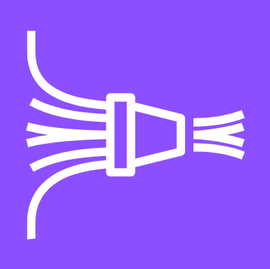

# &nbsp;&nbsp; Amazon Data Firehose

## 概要

ストリーミングデータを**S3・Redshift・OpenSearchなどの配信先に自動で届ける**フルマネージドサービス。
以前は「Kinesis Data Firehose」という名前だったが、現在は「Amazon Data Firehose」に改名。

Kinesis Data Streams との違いは「**自分でコンシューマーを実装しなくていい**」こと。
設定するだけで自動的にデータが配信先に届く。

→ Kinesis Data Streams との詳細比較は [Amazon Kinesis Data Streams](./Amazon_Kinesis_Data_Streams.md) を参照。

---

## アーキテクチャ

```
プロデューサー
├── アプリケーション
├── IoTデバイス
├── Kinesis Data Streams  ← Streamsと組み合わせることも多い
└── CloudWatch Logs
        ↓
┌─────────────────────────────────┐
│      Amazon Data Firehose       │
│                                 │
│  受信 → バッファリング → 変換    │
│         （数秒〜数分）  （任意） │
└─────────────────────────────────┘
        ↓ 自動配信
配信先
├── Amazon S3（最も一般的）
├── Amazon Redshift
├── Amazon OpenSearch Service
├── Apache Iceberg Tables
├── Amazon S3 Tables
├── Snowflake
└── サードパーティ（Datadog, Splunk など）
```

---

## バッファリング

Firehoseはデータを**一定量 or 一定時間**溜めてからまとめて配信する。

| 設定 | 範囲 |
|------|------|
| バッファサイズ | 1MB 〜 128MB |
| バッファ時間 | 60秒 〜 900秒 |

どちらかの条件を満たしたタイミングで配信される。

```
データ到着 → バッファに溜まる → 条件を満たしたら → S3へ配信
                                （1MB溜まった or 60秒経過）
```

これにより **Kinesis Data Streams（ミリ秒）より遅延が大きい（数十秒〜数分）** のが特徴。

---

## Firehoseは「リアルタイム」ではない

Firehoseはバッファリングがあるため**必ず遅延が発生する**。「ストリーミング配信」だが「リアルタイム処理」ではない。

```
データ到着
    ↓
Firehoseがバッファに溜め始める
    ↓（最低60秒待つ）
S3 / Redshift に配信
```

| サービス | 遅延 | 向いている用途 |
|---------|------|-------------|
| Kinesis Data Streams | ミリ秒 | 不正検知・即時アラート |
| Amazon Data Firehose | 最低60秒〜 | ログ蓄積・S3への継続配信 |

**「リアルタイム = Firehose」は誤り。** 試験の引っかけポイント。

---

## Kinesis Data Streams が優位になるケース

### ① ミリ秒レベルのリアルタイムが必要なとき

```
クレジットカード不正検知

カード利用 → Kinesis Streams → Lambda（即判定）→ 0.1秒でブロック  ✅
カード利用 → Firehose → S3（1分後）→ 分析 → 手遅れ             ✗
```

### ② 同じデータを複数の処理で同時に使いたいとき

```
Kinesis Data Streams
    ├── Lambda A（リアルタイム不正検知）
    ├── Lambda B（ユーザー行動分析）
    └── Firehose（S3に蓄積）
← 同じデータを複数の処理が同時に受け取れる
```

Firehoseは複数の異なる処理に同時に流せない。

### ③ データを再処理したいとき

```
Kinesis Streams: データを最大365日保持 → 再処理できる
Firehose      : 配信したらデータは消える → 再処理不可
```

### 判断軸まとめ

```
遅延が60秒以上でOK & シンプルに配信したいだけ → Firehose
ミリ秒が必要 or 複数処理 or 再処理したい      → Kinesis Data Streams
```

---

## データ変換（任意）

Lambdaと組み合わせることで、配信前にデータを変換できる。

```
データ到着
    ↓
Firehose受信
    ↓ （任意）Lambda で変換
    │  例: JSON → Parquet 変換
    │      不要フィールドの削除
    ↓
S3 / Redshift へ配信
```

---

## Kinesis Data Streams vs Amazon Data Firehose

| 観点 | Kinesis Data Streams | Amazon Data Firehose |
|------|---------------------|----------------------|
| 目的 | リアルタイム処理・柔軟な加工 | 配信先への自動デリバリー |
| コンシューマー実装 | 自分で実装が必要 | 不要（設定するだけ） |
| 遅延 | ミリ秒単位 | 数十秒〜数分（バッファリングあり） |
| データ保持 | 最大365日 | 保持しない（配信したら消える） |
| スケーリング | シャードを手動管理 | 自動スケーリング |
| 管理コスト | 高い | 低い（フルマネージド） |
| 向いている用途 | 複雑なリアルタイム処理 | シンプルなデータ配信・蓄積 |

---

## Kinesis Data Streams との組み合わせ

2つを組み合わせるパターンも多い。

```
プロデューサー
    ↓
Kinesis Data Streams（リアルタイム処理）
    ├── Lambda（即時処理・アラートなど）
    └── Amazon Data Firehose（S3への蓄積）
            ↓
           S3（後でバッチ分析）
```

「リアルタイム処理もしたいし、S3にも蓄積したい」というケースに使われる。

---

## 実務との対応

実務でやっていたAurora → Glue → S3 のパイプラインと比べると：

```
【実務のパイプライン（バッチ）】
Aurora → Glue（変換）→ S3

【Firehoseを使ったパイプライン（ストリーミング）】
IoT / ログ → Firehose → S3（自動的に継続蓄積）
```

Glueはバッチで定期実行、Firehoseはリアルタイムで継続的に配信し続けるのが違い。

---

## 試験のポイント

- **「S3/Redshiftへシンプルに配信したい」** → Amazon Data Firehose
- **「複雑なリアルタイム処理が必要」** → Kinesis Data Streams + Lambda
- **遅延が許容できるか** → Firehose（数十秒〜）か Streams（ミリ秒）かの判断軸
- **コンシューマー実装不要** → Firehoseの強み
- **Redshiftへのストリーミングロード** → Firehose経由が定番
