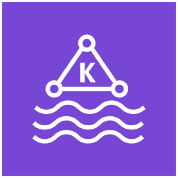

# &nbsp;&nbsp; Amazon MSK（Managed Streaming for Apache Kafka）

## 概要

**Apache Kafka のフルマネージドサービス**。
Kafka クラスターの構築・運用・スケーリングをAWSが管理してくれる。

```
データプロデューサー（アプリ・IoT・ログなど）
        ↓ メッセージを送信
Amazon MSK（Kafkaクラスター）
        ↓ メッセージを配信
データコンシューマー（Lambda・Glue・EMR・アプリなど）
```

---

## Apache Kafka とは

オープンソースの分散メッセージングシステム。
大規模なストリーミングデータの取り込み・配信を高スループットで処理できる。

```
主な概念:
├── Topic（トピック）: メッセージの分類・チャンネル
├── Producer（プロデューサー）: メッセージを送る側
├── Consumer（コンシューマー）: メッセージを受け取る側
└── Broker（ブローカー）: メッセージを管理するサーバー
```

---

## MSK の2つの形式

| | MSK（プロビジョニング） | MSK Serverless |
|--|--|--|
| クラスター管理 | 必要（ブローカー数・サイズを指定） | 不要 |
| スケーリング | 手動 | 自動 |
| コスト | クラスター稼働時間課金 | 使った分だけ課金 |
| 向いているケース | 大規模・安定したワークロード | 可変・突発的なワークロード |

---

## Kinesis Data Streams との比較

どちらもストリーミングデータの取り込み・配信サービス。

| 観点 | Amazon Kinesis | Amazon MSK |
|-----|---------------|-----------|
| ベース | AWS 独自 | Apache Kafka（OSS） |
| 移行性 | AWS に依存 | Kafka 互換 → 他クラウドにも移行しやすい |
| 設定の複雑さ | シンプル | 複雑（Kafkaの知識が必要） |
| メッセージ保持期間 | 最大365日 | 無制限（ストレージ上限まで） |
| スループット | シャード単位で制御 | パーティション単位で制御 |
| AWSサービスとの統合 | ネイティブ（Lambda・Firehoseなど） | 対応しているが設定が必要 |
| 向いているケース | AWSネイティブな構成・手軽に使いたい | 既存Kafkaシステムの移行・Kafka必須の要件 |

```
「AWSだけで完結・手軽に使いたい」          → Kinesis Data Streams
「既存のKafkaシステムをAWSに移行したい」    → Amazon MSK
「Kafkaの豊富なエコシステムを使いたい」     → Amazon MSK
「マルチクラウド・ベンダーロックイン回避」   → Amazon MSK
```

---

## Glue Streaming ETL・Lambda との連携

MSK はコンシューマーとして各サービスと連携できる。

```
データソース → Amazon MSK（Kafkaトピック）
                    ↓
        ├── AWS Lambda（イベントソースマッピング）
        ├── AWS Glue Streaming ETL
        └── Amazon EMR（Spark Structured Streaming）
```

---

## ユースケース

| ユースケース | 説明 |
|------------|------|
| **既存Kafkaの移行** | オンプレで動いていたKafkaクラスターをAWSに移行 |
| **マイクロサービス間の通信** | サービス間のイベント駆動な非同期通信 |
| **ログ収集・分析** | 大量のアプリケーションログをリアルタイムで収集 |
| **IoTデータ処理** | センサーデータをリアルタイムで処理 |

---

## 試験のポイント

- **Apache Kafka のマネージドサービス** → Amazon MSK
- **既存Kafkaシステムの移行** → MSK（Kafka互換のため移行しやすい）
- **AWSネイティブで手軽** → Kinesis。**Kafka互換・移行** → MSK
- **MSK Serverless** → クラスター管理不要・自動スケーリング
- **Glue Streaming ETL・Lambda** → MSKのコンシューマーとして使える
