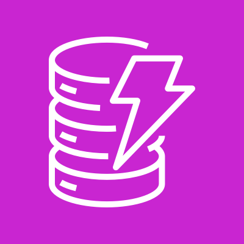

# &nbsp;&nbsp; Amazon DynamoDB

## 概要

AWSのフルマネージド**NoSQL**データベース。
高速・スケーラブルで、ミリ秒単位のレスポンスを保証する。

---

## DynamoDB本体の基礎

### キャパシティモード

| モード | 概要 | 向いているワークロード |
|--------|------|----------------------|
| **オンデマンド** | 事前のキャパシティ指定が不要。リクエスト量に応じて自動でスケールし、使った分だけ課金 | トラフィックが読めない・急変するワークロード |
| **プロビジョンド** | RCU / WCU を事前に指定。**Auto Scaling**で上下限を設定して自動調整も可能 | トラフィックが予測可能で、コストを最適化したいワークロード |

> RCU = Read Capacity Unit、WCU = Write Capacity Unit

### 主な上限（クォータ）

| 項目 | 値 |
|------|-----|
| **アイテム最大サイズ** | **400 KB**（属性名と値の合計） |
| **1パーティションあたりのスループット上限** | **3,000 RCU / 1,000 WCU** |

> ホットパーティション（特定パーティションへのアクセス集中）はこの上限がボトルネックになるため、パーティションキーの設計が重要。

### グローバルテーブル

複数リージョンにまたがる**アクティブ-アクティブのレプリケーション**を提供するマネージド機能。
どのリージョンのレプリカに対しても読み書きでき、変更は他リージョンへ自動伝播する。

```
リージョンA（東京）  ⇄  リージョンB（バージニア）  ⇄  リージョンC（フランクフルト）
   読み書き可             読み書き可                  読み書き可
   → 全レプリカ間で双方向に自動レプリケーション（マルチリージョン・低レイテンシ・DR対応）
```

### Zero-ETL統合

DynamoDB のデータを **ETLパイプライン不要**で分析・検索サービスへ自動連携する。

```
DynamoDB
   ├─ Zero-ETL → Amazon Redshift     （分析・集計）
   └─ Zero-ETL → Amazon OpenSearch    （全文検索）
```

> → Zero-ETL の詳細は [Zero-ETL](../00_concepts/Zero-ETL.md) を参照。

---

# DynamoDB Streams
<!-- DynamoDB Streamsは独立したサービスではなくDynamoDBの機能のため、専用アイコンは存在しない -->

## 概要

DynamoDBテーブルへの**データ変更（追加・更新・削除）をリアルタイムでキャプチャ**する機能。
変更が発生するたびに、その内容がストリームに記録される。

Kinesis Data Streams の「DynamoDB版」のようなイメージ。

```
DynamoDB テーブル
    ↓ データが変更される（追加・更新・削除）
DynamoDB Streams（変更内容をキャプチャ）
    ↓
コンシューマー（Lambda など）が処理
```

---

## キャプチャできる内容

| 設定（StreamViewType） | 内容 |
|----------------------|------|
| `KEYS_ONLY` | 変更されたアイテムのキーのみ |
| `NEW_IMAGE` | 変更後のアイテム全体 |
| `OLD_IMAGE` | 変更前のアイテム全体 |
| `NEW_AND_OLD_IMAGES` | 変更前・変更後の両方 |

---

## ユースケース

### ① 別テーブル・別DBへのレプリケーション

```
DynamoDB（本番テーブル）
    ↓ DynamoDB Streams
Lambda
    ↓
DynamoDB（別リージョンのテーブル）/ OpenSearch / Redshift
```

### ② キャッシュの自動更新

```
DynamoDB のデータが更新される
    ↓ Streams で検知
Lambda
    ↓
ElastiCache のキャッシュを自動で更新
```

### ③ 監査ログ・変更履歴の保存

```
DynamoDB のデータが変更される
    ↓ Streams（OLD_IMAGE + NEW_IMAGE）
Lambda
    ↓
S3 に変更履歴を保存（誰が何をいつ変えたか）
```

### ④ リアルタイム通知

```
注文テーブルに新規レコードが追加される
    ↓ Streams で検知
Lambda
    ↓
SNS でユーザーにメール通知
```

---

## Kinesis Data Streams との違い

| 観点 | DynamoDB Streams | Kinesis Data Streams |
|------|-----------------|---------------------|
| データソース | DynamoDBの変更のみ | 何でも（汎用） |
| 発生タイミング | DB変更時に自動発生 | プロデューサーが明示的にPut |
| データ保持期間 | **24時間固定** | 最大365日 |
| スケーリング | 自動（DynamoDBに連動） | シャードを手動管理 |
| 用途 | DBの変更イベント処理 | 汎用ストリーミング |

---

## Lambda との連携（イベントソースマッピング）

DynamoDB Streams も Kinesis と同様に**イベントソースマッピング**でLambdaと連携できる。

```
DynamoDB テーブルが更新される
    ↓
イベントソースマッピングが検知
    ↓
Lambda が自動起動
    ↓
変更内容を処理
```

→ イベントソースマッピングの詳細は [イベントソースマッピング](../00_concepts/イベントソースマッピング.md) を参照。

---

## 試験のポイント

- **DynamoDBの変更をリアルタイムで処理したい** → DynamoDB Streams
- **データ保持期間は24時間固定**（Kinesisのように延長できない）
- **StreamViewType** → `NEW_AND_OLD_IMAGES` が最も情報量が多い
- **Lambda との連携** → イベントソースマッピングを使う
- **変更履歴の保存・レプリケーション・キャッシュ更新** がよく出るユースケース
