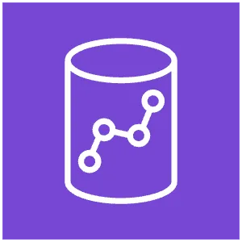

# &nbsp;&nbsp; Amazon Redshift

## 概要

AWSのフルマネージド**クラウドデータウェアハウス（DWH）**。
大量の構造化データに対して高速なSQL分析ができる。ペタバイト規模までスケール可能。

## なぜRedshiftは速いのか

### 列指向ストレージ（Columnar Storage）

通常のDBは行単位でデータを保存するが、Redshiftは**列単位**で保存する。

```
行指向（RDS など）:
[ID=1, 名前=田中, 売上=100]
[ID=2, 名前=鈴木, 売上=200]
    → 全列を読み込む → 分析には無駄が多い

列指向（Redshift）:
[ID: 1, 2, 3 ...]
[名前: 田中, 鈴木 ...]
[売上: 100, 200 ...]
    → 売上列だけ読めばいい → 分析クエリが速い
```

### MPP（超並列処理）

複数のノードでクエリを並列実行する。データ量が増えてもノードを追加すればスケールアップできる。

### 圧縮

列ごとに最適な圧縮をかけてストレージを節約し、I/Oを削減する。

---

## Redshiftのアーキテクチャ

```
クライアント（SQL）
    ↓
リーダーノード（クエリ解析・分散計画）
    ↓         ↓         ↓
コンピュートノード1  2  3  ...（並列実行）
```

| ノード | 役割 |
|--------|------|
| **リーダーノード** | クエリを受け付けて解析・分散 |
| **コンピュートノード** | 実際にデータを持ち並列でクエリを実行 |

---

## 主要な機能

### Zero-ETL Integration

Aurora や DynamoDB のデータを**ETLパイプライン不要でRedshiftに自動連携**する機能。
→ 詳細は [Zero-ETL](../00_concepts/Zero-ETL.md) を参照。

### Redshift Spectrum

S3上のデータを**Redshiftから直接クエリ**できる機能。
データをRedshiftにロードせずに分析できるため、ELTアーキテクチャと相性が良い。

```
Redshift → Spectrum → S3（データレイク）を直接クエリ
```

### Redshift Serverless

クラスターの管理が不要なサーバーレス版。使った分だけ課金。

### AQUA（Advanced Query Accelerator）

コンピュートノードの近くにキャッシュ層を持ち、クエリをさらに高速化する。

---

## RDS / Aurora との違い

| 観点 | Amazon RDS / Aurora | Amazon Redshift |
|------|--------------------|-----------------| 
| 用途 | トランザクション処理（OLTP） | 分析処理（OLAP） |
| データ量 | GB〜TB | TB〜PB |
| クエリ | 少量データを素早く取得 | 大量データを集計・分析 |
| ストレージ | 行指向 | 列指向 |
| 更新頻度 | 高い（リアルタイム） | 低い（バッチでロード） |

> **OLTP** = Online Transaction Processing（日々の業務処理）
> **OLAP** = Online Analytical Processing（分析・レポーティング）

---

## データのロード方法

```
S3           → COPY コマンド（最速・推奨）
DynamoDB     → COPY コマンド
Kinesis      → Kinesis Data Firehose 経由
RDS / Aurora → AWS Glue または DMS 経由
```

**COPYコマンドが基本**。INSERTを大量に叩くのはアンチパターン。

---

## 実務との対応

Aurora MySQL → Glue → CSV → S3 → BigQuery のパイプラインで、
もし分析先がBigQueryではなくAWSで完結するなら Redshift が候補になる。

```
Aurora MySQL
    ↓ AWS Glue（ETL）
    ↓
Amazon Redshift（分析・レポーティング）
    ↓
Amazon QuickSight（BIダッシュボード）
```

---

## BigQuery との比較

**RedshiftはAWSのBigQuery**と覚えておくとわかりやすい。

| 観点 | Amazon Redshift | Google BigQuery |
|------|----------------|----------------|
| 提供 | AWS | Google Cloud |
| 種別 | クラウドDWH | クラウドDWH |
| クエリ | SQL | SQL |
| 用途 | 大量データの分析・集計 | 大量データの分析・集計 |
| ストレージ | 列指向 | 列指向 |
| インフラ管理 | クラスターのサイズ選択が必要（Serverless版もあり） | 完全サーバーレス・管理不要 |
| 課金 | クラスター起動時間で課金 | クエリのデータスキャン量で課金 |

### 実務との対応

```
【実際にやっていたパイプライン】
Aurora → Glue → CSV → S3 → BigQuery（Google側で分析）

【AWSで完結させるなら】
Aurora → Glue → Redshift（AWSで分析）
            ↓
      Amazon QuickSight（BIダッシュボード）
```

---

## 試験のポイント

- **大量データの分析・集計** → Redshift（OLAPユースケース）
- **日々のトランザクション処理** → RDS / Aurora（OLTPユースケース）
- **S3のデータをそのまま分析したい** → Redshift Spectrum または Athena
- **データロードは COPY コマンド**が推奨（INSERT は遅い）
- **列指向ストレージ** → 分析クエリが速い理由として頻出
